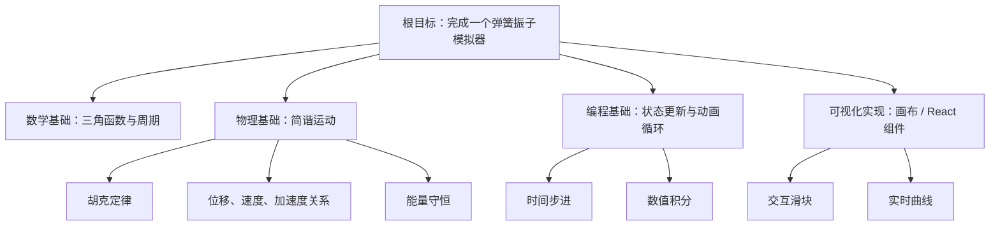
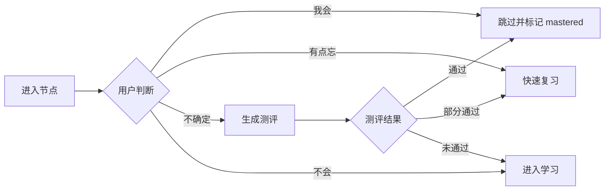
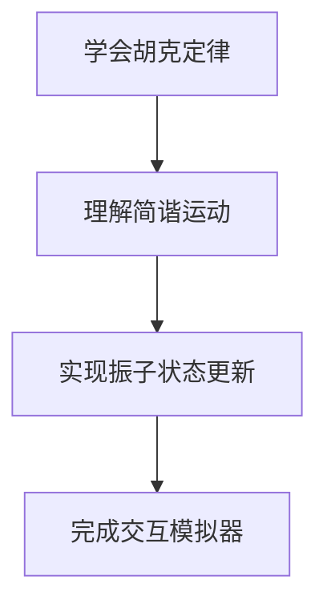
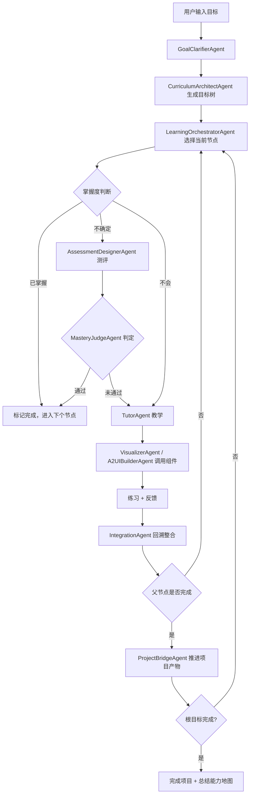

对，**如果当前聊天、SSE 流、A2UI 组件调用、Gallery 预览、插件注册这些链路都已经稳定跑通**，那下一阶段就很自然：从“能对话 + 能展示组件”，升级成“能围绕用户目标组织学习与创作过程的多智能体系统”。

我会把 AhaTutor 的未来方向理解为：

> 用户不是来“上课”的，而是带着一个想完成的项目来。系统帮助他拆解目标、识别知识缺口、生成学习路径、动态测评、用可视化组件解释关键概念，并一路把学习回收成项目能力。

**核心产品形态**
AhaTutor 应该从普通 AI Tutor 变成一个 **Project-Based Learning Agent System**。

用户输入的不是“教我物理”，而是：

- 我想做一个弹簧振子模拟器
- 我想写一个 2D 游戏物理引擎
- 我想做一个 AI 单词学习 App
- 我想理解 Transformer 并复现一个小模型
- 我想做一个个人财务分析工具

系统输出的也不是一串课程目录，而是一个“目标树”：



然后每个节点都可以被判断：

- 已掌握：跳过
- 有点忘：快速复习
- 不确定：测评
- 不会：进入学习
- 学完：回到上层节点
- 子节点完成：聚合成父节点能力
- 最终：回到根项目，完成真实产物

**需要开发的功能模块**
我建议后续按这几个核心模块推进。

1. **Goal Intake 目标理解模块**

负责把用户的自然语言愿望转成结构化目标。

输入：

> “我想做一个能展示行星轨道的交互网页。”

输出：

```json
{
  "goal": "制作一个行星轨道交互网页",
  "domain": ["物理", "数学", "前端开发", "可视化"],
  "artifact": "interactive_web_app",
  "difficulty": "intermediate",
  "constraints": {
    "time": null,
    "priorKnowledge": null,
    "preferredStyle": "visual"
  }
}
```

对应智能体：

- `GoalClarifierAgent`：澄清目标、约束、用户已有基础
- `ProjectInterpreterAgent`：把目标解释成项目类型、产物形式、领域范围

2. **Knowledge Tree 目标树生成模块**

这是整个系统的骨架。它负责把根目标拆成学习节点树。

每个节点建议包含：

```ts
type LearningNode = {
  id: string;
  title: string;
  description: string;
  parentId?: string;
  children: string[];
  prerequisites: string[];
  masteryCriteria: string[];
  estimatedDifficulty: "easy" | "medium" | "hard";
  status: "unknown" | "skipped" | "review" | "learning" | "mastered";
  componentHints: string[];
};
```

对应智能体：

- `CurriculumArchitectAgent`：自上而下拆解目标树
- `PrerequisiteMapperAgent`：判断节点依赖关系
- `DifficultyCalibratorAgent`：根据用户水平调节粒度

3. **Mastery Assessment 掌握度判断模块**

每个节点进入学习前，系统不应该默认用户不会，而是给用户选择权。

节点状态流可以是：



对应智能体：

- `MasteryJudgeAgent`：根据回答判断掌握度
- `AssessmentDesignerAgent`：生成小测、开放题、操作题
- `MisconceptionDetectorAgent`：识别用户误解点

4. **Learning Session 学习会话模块**

这是当前聊天能力的进化版。它不只是回答问题，而是围绕当前节点教学。

学习内容应该分层：

- 直觉解释
- 例子
- 可视化组件
- 互动问题
- 类比
- 小练习
- 与根项目的关系

对应智能体：

- `TutorAgent`：主教学智能体
- `ExplainerAgent`：负责极易理解的解释
- `VisualizerAgent`：决定调用哪个 A2UI 组件
- `SocraticAgent`：追问、引导用户自己说出关键结论

5. **A2UI Component Planning 组件规划模块**

你们已经有组件调用能力，后续关键是让组件不只是“展示”，而是成为教学策略的一部分。

比如学习“简谐运动”时，系统应该知道：

- 要展示弹簧振子
- 要暴露质量、劲度系数、阻尼滑块
- 要同步展示位移-时间曲线
- 要在用户调参后解释变化原因

对应智能体：

- `ComponentSelectorAgent`：选择可用组件
- `InteractionDesignerAgent`：设计组件交互流程
- `A2UIBuilderAgent`：生成 A2UI JSONL 消息
- `VisualExplanationAgent`：把组件状态解释成概念语言

6. **Backtracking 回溯与整合模块**

这是你愿景里很关键的一点：不是学完叶子节点就结束，而是逐层回到根节点。

例如：



每次子节点完成，系统都要问：

> 这个知识现在如何服务于你的项目？

对应智能体：

- `IntegrationAgent`：把子知识合并成父能力
- `ReflectionAgent`：让用户复述、迁移、解释
- `ProjectBridgeAgent`：把学习结果转化为项目实现步骤

7. **Project Builder 项目产物推进模块**

最终用户是为了“做成东西”，所以系统需要能从学习树切到创作执行。

比如：

- 学完 React 状态管理 → 写一个交互控件
- 学完简谐运动 → 实现模拟公式
- 学完图像渲染 → 做可视化曲线
- 学完全部子节点 → 组装完整 Demo

对应智能体：

- `ProjectPlannerAgent`：把学习节点映射到项目里程碑
- `ImplementationGuideAgent`：指导用户一步步实现
- `CodeAssistantAgent`：必要时生成代码
- `ReviewAgent`：检查用户作品和理解是否一致

**推荐的多 Agent 工作流**
我建议采用“一个编排器 + 多个专家智能体”的结构，而不是让所有智能体彼此自由聊天。

核心是 `LearningOrchestratorAgent`。

它负责维护全局状态：

```ts
type LearningWorkflowState = {
  userGoal: ProjectGoal;
  knowledgeTree: LearningNode[];
  currentNodeId: string;
  masteredNodeIds: string[];
  skippedNodeIds: string[];
  weakNodeIds: string[];
  currentMode: "planning" | "assessment" | "learning" | "review" | "building";
  projectProgress: ProjectMilestone[];
};
```

整体流程：



**智能体节点建议**
第一阶段不需要太多，先做 8 个就够。

| 智能体 | 职责 |
|---|---|
| `LearningOrchestratorAgent` | 总控，维护状态，决定下一步 |
| `GoalClarifierAgent` | 理解用户目标和约束 |
| `CurriculumArchitectAgent` | 生成学习树 |
| `AssessmentDesignerAgent` | 为节点生成测评 |
| `MasteryJudgeAgent` | 判断用户是否掌握 |
| `TutorAgent` | 负责正式教学 |
| `VisualizerAgent` | 决定何时调用 A2UI 组件 |
| `IntegrationAgent` | 子节点回溯到父节点，连接项目目标 |

第二阶段再加入：

| 智能体 | 职责 |
|---|---|
| `MisconceptionDetectorAgent` | 识别误区 |
| `ProjectPlannerAgent` | 把学习树转成项目里程碑 |
| `CodeAssistantAgent` | 辅助代码实现 |
| `ReflectionAgent` | 让用户总结、迁移、复述 |
| `MotivationAgent` | 维持节奏、降低挫败感 |
| `MemoryAgent` | 维护长期学习画像 |

**系统模块落地建议**
从代码架构看，后端可以新增：

```txt
/backend/app/
├── agents/
│   ├── orchestrator.py
│   ├── goal_clarifier.py
│   ├── curriculum_architect.py
│   ├── assessment_designer.py
│   ├── mastery_judge.py
│   ├── tutor.py
│   ├── visualizer.py
│   └── integration.py
│
├── workflow/
│   ├── state.py
│   ├── graph.py
│   ├── node_runner.py
│   └── transitions.py
│
├── learning/
│   ├── schemas.py
│   ├── knowledge_tree.py
│   ├── mastery.py
│   └── project_bridge.py
```

前端可以新增：

```txt
/frontend/src/
├── learning/
│   ├── KnowledgeTreeView.tsx
│   ├── NodeStatusPanel.tsx
│   ├── MasteryCheck.tsx
│   ├── LearningPathHeader.tsx
│   └── ProjectProgress.tsx
```

用户界面上，主屏幕可以逐渐从“聊天窗口”升级成三层结构：

```txt
左侧：项目目标树 / 当前节点 / 掌握状态
中间：教学对话 + A2UI 可视化组件
右侧：项目进度 / 当前产物 / 反思总结
```

但注意：不要一开始就做成复杂 IDE。你们的设计方向是 “The Illuminated Mind”，所以应该保持一种高端、留白、流动的学习空间感，而不是变成任务管理软件。

**最小可行版本**
我建议下一步先做一个闭环 MVP：

1. 用户输入一个项目目标
2. 后端生成一棵 2-3 层学习树
3. 前端展示树结构
4. 用户点击一个节点
5. 系统询问：会 / 不确定 / 不会
6. 不确定时生成 3 道测评
7. 不会时进入教学
8. 教学过程中能调用 A2UI 组件
9. 学完后标记节点完成
10. 子节点完成后回溯到父节点
11. 最终生成“我现在已经能完成这个项目的哪些部分”

这一版完成后，AhaTutor 就会从“会讲解的聊天工具”变成“有学习路径和项目推进能力的智能学习系统”。

**我的建议方向**
短期目标：  
先实现 `LearningOrchestratorAgent + KnowledgeTree + MasteryCheck + Tutor + Visualizer`。

中期目标：  
加入用户学习画像、节点掌握度记忆、项目里程碑、跨会话恢复。

长期目标：  
形成一个真正的“项目驱动学习操作系统”：用户带着目标来，系统拆解知识、评估掌握、生成解释、调用组件、推进项目，最后让用户真正拥有完成目标的能力。