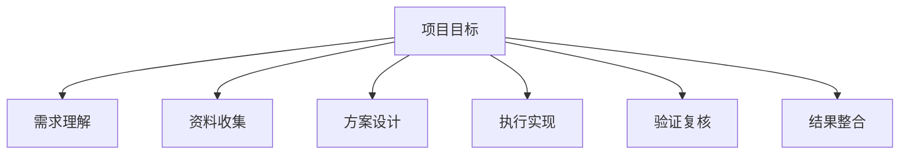

# 智能聚合系统 PRD

## 1. 文档信息

- 产品名称：智能聚合系统
- 所属项目：Universe Model Agent / 宇宙模型智能体
- 文档版本：v0.1
- 创建日期：2026-06-21
- 目标阶段：MVP 到可用原型

## 2. 产品背景

当前系统已经具备多模型测试、图片 OCR、Mathpix/MinerU 校正、本地模型与在线模型接入等能力。但这些能力目前主要面向“单次调用”或“多模型横向对比”，尚未形成一个可以承接完整项目目标、自动拆解任务、调度多模型协作、持续管理进度并最终整合交付结果的智能工作流。

智能聚合系统的目标是把多个 LLM 从“并列回答者”升级为“可调度的协作执行资源”。系统面对任意项目时，先理解目标，再拆解为可执行子任务，根据子任务复杂度、难度、模态需求、上下文长度、成本、速度和可靠性，将任务分配给合适模型或模型组合；执行过程中持续记录状态、处理失败、发起复核，最终把多个模型的输出整合成可落地的行动方案、计划、代码、文档或研究成果。

## 3. 产品目标

### 3.1 核心目标

1. 支持用户输入任意项目目标，自动生成结构化任务树。
2. 根据子任务类型和难度，为系统中的所有可用 LLM 自动分配任务。
3. 支持并行执行、串行依赖、失败重试、模型 fallback、多模型复核。
4. 在执行过程中提供进度管理、状态追踪、风险提示和人工介入入口。
5. 在任务完成后自动整合结果，形成统一交付物。
6. 逐步沉淀模型能力画像，让调度策略随使用过程变得更可靠。

### 3.2 MVP 目标

MVP 阶段重点完成“能跑通”的闭环：

- 项目目标输入
- 任务拆解
- 模型能力注册
- 子任务分配
- 多模型执行
- 进度看板
- 结果整合
- 人工确认与导出

## 4. 非目标

MVP 阶段不优先实现：

- 完全无人值守的复杂项目交付
- 精细到真实商业项目管理软件级别的权限、工时、资源管理
- 对所有模型成本的精确财务核算
- 自主修改生产环境代码并自动上线
- 替代人类最终判断

系统应默认把 LLM 输出视为“候选结果”，关键决策和高风险操作需要人工确认。

## 5. 目标用户

### 5.1 主要用户

- 研究者：需要把研究课题拆解为文献检索、数据处理、实验设计、结果整理等子任务。
- 开发者：需要把软件需求拆解为架构设计、代码实现、测试、文档、部署等子任务。
- 教学内容创作者：需要把课程主题拆解为知识结构、可视化设计、脚本、练习题和讲解稿。
- 本地模型使用者：希望把校园网本地模型、Gemini、云雾 GPT-5.5、Mathpix 等组合起来使用。

### 5.2 用户痛点

- 不知道复杂项目应该如何拆解。
- 不知道哪个模型更适合哪个子任务。
- 多模型输出分散，难以管理、比较和整合。
- 执行过程缺乏状态追踪，容易遗忘上下文。
- 失败后缺乏自动 fallback 和复核机制。
- 成本、速度、质量之间缺少可控策略。

## 6. 核心概念

### 6.1 Project

用户输入的完整目标，例如：

- “把这本书 OCR 后校正成高质量 Markdown。”
- “为宇宙模型智能体设计一个交互式月食教学模块。”
- “分析一个代码仓库并重构成可维护架构。”

### 6.2 Task

Project 被拆解后的可执行子任务。每个 Task 应包含：

- 任务目标
- 输入材料
- 预期输出
- 难度等级
- 复杂度等级
- 所需能力
- 推荐模型
- 验收标准
- 依赖关系
- 当前状态

### 6.3 Model Profile

系统中每个模型的能力画像。包括：

- Provider：local、gemini、yunwu、mathpix、future-provider
- 模型名称
- 是否支持文本
- 是否支持图片
- 是否支持长上下文
- 是否擅长代码
- 是否擅长数学/OCR
- 是否适合规划
- 是否适合复核
- 平均延迟
- 失败率
- 成本等级
- 可用状态

### 6.4 Assignment

子任务与模型之间的分配关系。一个子任务可以分配给：

- 单个模型
- 多个模型并行回答
- 主模型 + 复核模型
- 快速模型先做草稿，高质量模型再审查
- 专用工具模型，例如 Mathpix 只用于 OCR/数学识别

### 6.5 Run

一次执行记录。包括输入、模型、输出、耗时、错误、重试、评价和最终是否采纳。

## 7. 核心用户流程

### 7.1 新建项目

1. 用户输入项目目标和约束。
2. 系统生成初始任务拆解。
3. 用户确认或修改任务树。
4. 系统生成执行计划。
5. 用户启动执行。

### 7.2 任务拆解

系统应将项目拆解为多层任务树：



每个叶子任务必须可执行、可检查、可复用。

### 7.3 模型分配

系统根据任务属性选择模型：

| 任务类型 | 推荐策略 |
| --- | --- |
| 总体规划 | 高推理模型优先，必要时多模型复核 |
| 快速草稿 | 低成本快速模型优先 |
| 代码实现 | 代码能力强、上下文稳定的模型优先 |
| 数学公式 OCR | Mathpix / Gemini 视觉 / 本地视觉模型 |
| 长文整理 | 长上下文模型优先 |
| 事实核查 | 多模型 + 外部检索工具 |
| 结果整合 | 高推理模型 + 原始证据引用 |

### 7.4 执行管理

每个任务状态包括：

- `pending`
- `assigned`
- `running`
- `needs_review`
- `blocked`
- `failed`
- `completed`
- `integrated`

系统应在任务状态变化时更新项目进度，并记录关键原因。

### 7.5 结果整合

系统不应简单拼接多个模型输出，而应进行结构化整合：

1. 提取每个模型输出的主张、方案、代码、证据和风险。
2. 合并一致内容。
3. 标记冲突内容。
4. 对冲突内容调用复核模型或请求人工确认。
5. 输出最终统一版本。

## 8. 功能需求

### 8.1 项目输入模块

用户可以输入：

- 项目目标
- 背景材料
- 文件附件
- 约束条件
- 输出格式
- 时间/成本偏好
- 是否允许联网
- 是否允许调用付费模型

验收标准：

- 用户能够创建一个项目。
- 项目输入能保存为结构化配置。
- 项目可以继续编辑。

### 8.2 任务拆解模块

系统应自动生成任务树。

任务字段：

```json
{
  "id": "task-001",
  "title": "分析项目目标",
  "description": "理解用户目标并提取约束。",
  "difficulty": "medium",
  "complexity": "low",
  "requiredCapabilities": ["planning", "summarization"],
  "dependencies": [],
  "expectedOutput": "结构化项目需求摘要",
  "acceptanceCriteria": ["列出目标", "列出约束", "列出风险"],
  "status": "pending"
}
```

验收标准：

- 系统能生成 3 到 20 个初始任务。
- 每个任务都有预期输出和验收标准。
- 用户可以手动新增、删除、合并、拆分任务。

### 8.3 模型注册与能力画像

系统应维护统一模型注册表。

模型来源包括：

- 校园网本地模型
- Gemini key 池
- 云雾 GPT-5.5
- Mathpix
- 后续新增 provider

模型字段：

```json
{
  "id": "gemini:gemini-2.5-flash",
  "provider": "gemini",
  "displayName": "Gemini 2.5 Flash",
  "modalities": ["text", "image"],
  "strengths": ["vision", "ocr", "summarization"],
  "weaknesses": ["unstable quota"],
  "costLevel": "low",
  "latencyLevel": "medium",
  "reliabilityScore": 0.82,
  "enabled": true
}
```

验收标准：

- 前端能显示所有可用模型。
- 模型能力可被调度器读取。
- 不在前端暴露 API key。

### 8.4 任务调度模块

调度器应根据以下因素分配模型：

- 任务类型
- 难度
- 复杂度
- 输入模态
- 输出格式
- 模型能力
- 成本限制
- 速度要求
- 当前可用性
- 历史成功率

调度策略：

1. 简单任务：低成本快速模型。
2. 中等任务：主模型执行，低成本模型辅助。
3. 困难任务：多个强模型并行，整合模型裁决。
4. 高风险任务：执行模型 + 审查模型。
5. 图片/OCR 任务：优先专用 OCR 或视觉模型。

验收标准：

- 每个任务能生成推荐模型列表。
- 用户可以接受或手动调整分配。
- 调度理由可解释。

### 8.5 执行引擎

执行引擎负责调用模型并保存结果。

能力要求：

- 并发执行多个独立任务。
- 处理任务依赖。
- 支持失败重试。
- 支持 provider fallback。
- 支持超时控制。
- 支持暂停、恢复、取消。
- 保存 raw response 和规范化输出。

验收标准：

- 系统能执行完整任务树。
- 单个任务失败不会导致整个项目崩溃。
- 失败原因可查看。

### 8.6 进度管理模块

提供项目级和任务级状态视图。

视图包括：

- 总进度
- 任务看板
- 模型调用状态
- 当前阻塞点
- 成本/调用次数摘要
- 已完成成果
- 待人工确认项

验收标准：

- 用户能看到每个任务当前状态。
- 用户能识别哪些任务失败、阻塞或需要复核。
- 用户能一键重试失败任务。

### 8.7 结果复核模块

复核模块用于判断模型输出是否可采纳。

复核方式：

- 规则校验
- 多模型交叉审查
- 人工确认
- 测试/编译/渲染验证
- 来源一致性检查

验收标准：

- 系统能标记低置信度结果。
- 用户能查看模型之间的差异。
- 关键任务默认进入 `needs_review` 状态。

### 8.8 结果整合模块

整合模块负责将多个任务结果合成最终交付物。

支持输出：

- 行动方案
- 项目计划
- 技术设计文档
- PRD
- 代码修改计划
- 实验报告
- OCR 校正文档
- 最终 Markdown / PDF / HTML

验收标准：

- 最终输出能追溯到子任务结果。
- 冲突内容被明确标记。
- 用户可以重新生成整合结果。

### 8.9 人工介入模块

系统应在以下情况请求用户确认：

- 任务目标不明确。
- 多模型输出冲突严重。
- 需要调用付费模型。
- 需要执行破坏性操作。
- 需要访问敏感文件或密钥。
- 验证失败但模型认为完成。

验收标准：

- 用户可以批准、拒绝或修改系统建议。
- 人工决策被记录到项目日志。

## 9. 前端需求

### 9.1 项目工作台

左侧：

- 项目目标
- 模型池状态
- 预算/速度偏好
- 执行控制

中间：

- 任务树 / 任务看板
- 当前执行日志
- 子任务详情

右侧：

- 模型输出对比
- 复核结果
- 最终整合稿

### 9.2 任务视图

每个任务卡片显示：

- 标题
- 状态
- 难度/复杂度
- 分配模型
- 最近一次输出摘要
- 错误/阻塞原因
- 操作按钮：执行、暂停、重试、复核、整合

### 9.3 模型调度视图

显示：

- 可用模型列表
- 每个模型能力标签
- 当前调用状态
- 历史成功率
- 本轮任务分配
- 手动调整入口

### 9.4 整合视图

显示：

- 最终交付稿
- 引用的子任务来源
- 冲突点
- 待确认点
- 导出按钮

## 10. 后端需求

### 10.1 模块划分

建议新增模块：

- `backend/services/aggregate_project.py`
- `backend/services/task_decomposer.py`
- `backend/services/model_registry.py`
- `backend/services/model_scheduler.py`
- `backend/services/task_executor.py`
- `backend/services/result_integrator.py`
- `backend/services/progress_tracker.py`

### 10.2 API 草案

#### 创建项目

```http
POST /api/aggregate/projects
```

#### 获取项目详情

```http
GET /api/aggregate/projects/{projectId}
```

#### 拆解任务

```http
POST /api/aggregate/projects/{projectId}/decompose
```

#### 分配模型

```http
POST /api/aggregate/projects/{projectId}/schedule
```

#### 启动执行

```http
POST /api/aggregate/projects/{projectId}/run
```

#### 获取进度

```http
GET /api/aggregate/projects/{projectId}/progress
```

#### 重试任务

```http
POST /api/aggregate/tasks/{taskId}/retry
```

#### 整合结果

```http
POST /api/aggregate/projects/{projectId}/integrate
```

## 11. 数据模型

### 11.1 Project

```json
{
  "id": "project-001",
  "title": "OCR 校正整书 Markdown",
  "goal": "将原书 PDF 与 MinerU 初稿结合，用 Mathpix 校正高风险块。",
  "constraints": {
    "maxCost": "low",
    "allowPaidModels": true,
    "allowNetwork": true
  },
  "status": "running",
  "createdAt": "2026-06-21T00:00:00+08:00",
  "updatedAt": "2026-06-21T00:10:00+08:00"
}
```

### 11.2 Task

```json
{
  "id": "task-001",
  "projectId": "project-001",
  "title": "识别高风险 OCR 块",
  "status": "completed",
  "difficulty": "medium",
  "complexity": "medium",
  "dependencies": [],
  "assignedModels": ["local:qwen3.6-27b:latest", "gemini:gemini-2.5-flash"],
  "outputs": ["run-001", "run-002"],
  "selectedOutput": "run-002"
}
```

### 11.3 Run

```json
{
  "id": "run-001",
  "taskId": "task-001",
  "modelId": "gemini:gemini-2.5-flash",
  "status": "completed",
  "input": {},
  "output": {},
  "latencyMs": 3812,
  "tokens": 1420,
  "error": null,
  "confidence": 0.78
}
```

## 12. 调度策略

### 12.1 难度分级

| 等级 | 特征 | 调度策略 |
| --- | --- | --- |
| easy | 明确、短文本、低风险 | 快速模型单独执行 |
| medium | 需要一定推理或结构化输出 | 主模型执行，必要时复核 |
| hard | 多步骤、高不确定性、长上下文 | 多模型并行 + 整合 |
| critical | 高风险、高成本、影响最终交付 | 强模型执行 + 强模型复核 + 人工确认 |

### 12.2 模型组合模式

- Draft-Review：便宜模型起草，强模型审查。
- Parallel-Compare：多个模型并行输出，整合模型比较。
- Specialist-First：专用模型先处理，例如 Mathpix OCR。
- Fallback-Chain：主模型失败后按顺序 fallback。
- Consensus：多个模型一致时自动采纳，不一致时人工确认。

## 13. 质量指标

### 13.1 产品指标

- 任务拆解采纳率
- 自动分配采纳率
- 子任务完成率
- 首次成功率
- 重试后成功率
- 人工介入次数
- 最终交付采纳率

### 13.2 模型指标

- 平均响应时间
- 失败率
- 超时率
- 输出可用率
- 人工采纳率
- 复核通过率
- 单任务成本估计

### 13.3 项目指标

- 项目完成时间
- 阻塞任务数量
- 自动完成任务比例
- 用户修改次数
- 交付物质量评分

## 14. 安全与隐私

1. API key 只能存储在环境变量或后端安全配置中。
2. 前端不得展示明文 API key。
3. 付费模型调用前应有开关和提示。
4. 敏感文件必须在调用模型前经过用户确认。
5. 所有模型调用日志应默认脱敏。
6. 用户可删除项目及其所有调用记录。

## 15. MVP 里程碑

### Milestone 1：模型注册与项目输入

- 接入统一模型注册表。
- 显示本地模型、Gemini、云雾、Mathpix。
- 支持创建项目。

### Milestone 2：任务拆解与人工确认

- 输入项目目标后生成任务树。
- 支持用户编辑任务树。
- 为每个任务生成验收标准。

### Milestone 3：模型调度与执行

- 根据任务标签推荐模型。
- 支持单任务执行。
- 支持并行执行多个独立任务。

### Milestone 4：进度管理

- 提供任务状态看板。
- 显示运行日志、失败原因和重试按钮。

### Milestone 5：结果整合

- 汇总子任务结果。
- 标记冲突内容。
- 生成最终交付稿。

### Milestone 6：评估与优化

- 记录模型表现。
- 根据历史表现优化调度。
- 支持导出项目报告。

## 16. 验收标准

MVP 完成时，系统应支持以下端到端场景：

1. 用户输入一个项目目标。
2. 系统生成任务拆解。
3. 用户确认任务树。
4. 系统为每个任务推荐模型。
5. 用户启动执行。
6. 系统并行调用多个模型。
7. 系统展示任务状态和执行日志。
8. 失败任务可以重试或 fallback。
9. 多模型输出可以比较。
10. 系统生成最终整合结果。
11. 用户可以导出交付物。

## 17. 风险与对策

| 风险 | 影响 | 对策 |
| --- | --- | --- |
| 模型输出质量不稳定 | 交付结果不可控 | 引入复核、评分、人工确认 |
| 免费模型额度耗尽 | 执行中断 | key 池轮换、fallback、额度状态提示 |
| 本地模型接口不稳定 | 任务失败 | 超时、重试、降级到在线模型 |
| 任务拆解过粗或过细 | 执行效率低 | 支持人工调整和二次拆解 |
| 成本不可控 | 产生额外费用 | 付费模型开关、预算上限、调用确认 |
| 多模型结果冲突 | 整合困难 | 冲突检测、裁决模型、人工确认 |
| 上下文丢失 | 项目难以连续推进 | 项目级状态、任务日志、交接摘要 |

## 18. 后续扩展

- 支持长期项目记忆。
- 支持自动生成 PR / commit / release note。
- 支持与 GitHub Issues、Notion、Obsidian、Zotero 集成。
- 支持模型能力自动评测。
- 支持 A2UI 可视化调度面板。
- 支持多项目队列和批量执行。
- 支持团队协作和权限管理。

## 19. 一句话定义

智能聚合系统不是一个简单的多模型聊天页面，而是一个面向完整项目交付的 LLM 协作调度系统：它负责理解目标、拆解任务、分配模型、管理进度、复核输出，并把分散的模型能力整合成可执行、可验证、可交付的最终成果。
