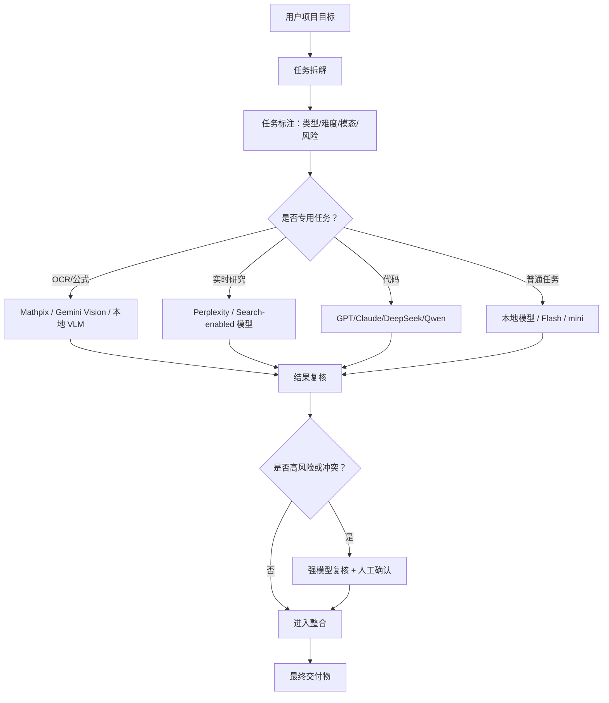

# 主流 LLM 能力分析

> 版本：v0.1  
> 日期：2026-06-21  
> 用途：为“智能聚合系统”的任务拆解、模型调度、进度管理和结果整合提供模型能力画像。  
> 说明：本文不是通用排行榜，而是面向项目执行的工程化选型分析。模型能力、价格、上下文长度和可用性变化很快，应定期刷新。

## 1. 结论摘要

智能聚合系统不应把所有任务都交给“最强模型”。更合理的策略是把 LLM 当成不同类型的执行资源：

- **旗舰推理/编码模型**：负责复杂规划、架构设计、长链路代码任务、结果整合和高风险复核。
- **高性价比通用模型**：负责常规问答、摘要、批处理、结构化提取、轻量代码和初稿生成。
- **小模型/本地模型**：负责隐私敏感、低成本、高并发、低延迟、可重复的简单任务。
- **多模态模型**：负责图片、PDF、图表、截图、GUI、视频、音频等输入。
- **专用工具模型/API**：例如 Mathpix 做数学 OCR，Perplexity/Sonar 做 web-grounded research，Embedding/Rerank 模型做检索。
- **开源/open-weight 模型**：负责可控部署、私有化、微调、成本控制和离线场景。

聚合系统的调度原则：

1. **简单任务用便宜快速模型**，复杂任务再升级。
2. **高风险任务用多模型复核**，不要只看单模型输出。
3. **图片、数学、OCR、检索等任务优先专用模型**，不要让通用聊天模型硬做。
4. **长上下文任务优先长上下文模型**，但仍要切块、引用来源和做局部复核。
5. **本地模型适合作为初筛、草稿、隐私任务和离线 fallback**。
6. **最终整合应由强推理模型完成，并保留子任务来源和冲突点**。

## 2. 评估维度

### 2.1 任务难度等级

| 等级 | 名称 | 典型任务 | 推荐模型策略 |
| --- | --- | --- | --- |
| L1 | 简单 | 分类、标签、短摘要、格式转换、字段抽取 | 小模型、mini/nano、Flash、Haiku、本地轻量模型 |
| L2 | 中等 | 多段摘要、普通问答、简单代码、轻量数据分析、常规文案 | 高性价比通用模型，必要时抽样复核 |
| L3 | 困难 | 多步骤推理、复杂代码、长文档分析、数学推导、跨文件理解 | 旗舰模型或 reasoning 模型，配合验证工具 |
| L4 | 高风险/专家 | 长周期 agent、系统架构、法律/医疗/金融、科研结论、生产代码合并 | 多模型并行、强模型复核、人工确认、测试验证 |

### 2.2 复杂度轴

聚合系统应从以下维度判断任务复杂度，而不是只看文本长度：

- **推理深度**：是否需要多步逻辑、数学、代码推理。
- **上下文长度**：是否需要处理整本书、代码仓库、长 PDF、多轮对话。
- **模态数量**：是否包含图片、表格、公式、音频、视频、GUI 截图。
- **工具使用**：是否需要搜索、文件读写、代码执行、浏览器、数据库。
- **领域风险**：是否涉及法律、医疗、金融、安全、生产环境。
- **输出可验证性**：是否能通过测试、编译、渲染、引用检查、diff 验证。
- **成本敏感度**：是否适合大量调用，是否允许付费模型。
- **延迟敏感度**：是否要求实时交互或批处理吞吐。

## 3. 主流闭源/API 模型能力分析

### 3.1 总览表

| 模型家族 | 代表模型/服务 | 主要优势 | 适合任务 | 不适合任务 | 调度建议 |
| --- | --- | --- | --- | --- | --- |
| OpenAI GPT 系列 | GPT-5.5、GPT-5.4、GPT-5.4 mini/nano | 复杂推理、代码、工具调用、专业工作、视觉、多工具 agent | L3-L4 规划、代码、系统设计、结果整合、复杂文档 | 极低成本批处理、强私有化 | 作为旗舰规划/整合/复核模型；mini/nano 做批量轻任务 |
| Anthropic Claude | Opus 4.8、Sonnet、Haiku 4.5 | 长上下文、严谨写作、代码 agent、视觉、较强可控性 | 长文档、代码重构、方案评审、专业写作 | 极高并发低成本任务 | Opus 做高风险复核，Haiku 做快速原型和低成本批处理 |
| Google Gemini | Gemini 3.1 Pro、Gemini 3.5 Flash、Gemini 2.5 Pro/Flash | 多模态、长上下文、Google 生态、音视频、低价高吞吐 | 图片/PDF/音视频理解、agentic coding、大规模处理 | 对稳定性要求极高时需避开 preview/latest alias | Flash 做高并发，Pro 做复杂推理和多模态复核 |
| xAI Grok | Grok 4.3、Grok Build、Imagine、Voice | 实时搜索工具、对话、代码、图像/视频/语音 API | 当前事件、搜索增强问答、代码、社交/趋势分析 | 不启用搜索时不适合最新事实问题 | 搜索类任务可作为 Perplexity 之外的候选 |
| Mistral | Medium 3.5、Small 4、Devstral 2、OCR 3 | 欧洲/主权部署、代码 agent、OCR、轻量高性价比 | 企业部署、代码、OCR、低成本通用任务 | 顶级复杂推理可作为备选而非唯一 | 用作成本友好的通用/代码/OCR provider |
| Cohere | Command A、Command A Reasoning、Command A Vision | 企业 RAG、多语言、工具使用、翻译、文档图表 OCR | RAG、企业知识库、文档问答、翻译 | 通用消费聊天、开放式创意 | RAG 和企业文档任务优先考虑 |
| Amazon Nova | Nova 2 / Nova Premier / Pro / Lite | Bedrock 生态、低成本、企业安全、文档/视频/agent | AWS 内企业应用、多模态、RAG、agent | 非 AWS 技术栈可能接入成本高 | AWS 项目中作为主力企业模型 |
| Perplexity Sonar | Sonar API / Agent API | 内置 web-grounded AI、搜索、引用、实时信息 | 市场研究、事实核查、竞品分析、时效性问答 | 不需要联网或私有数据任务 | 作为“联网研究/事实核查”专用工具 |
| Moonshot Kimi | Kimi K2.6、K2 Thinking | 长周期推理、代码、agent、中文生态 | 中文研究、长上下文、代码、战略分析 | 强合规企业部署需评估 | 中文复杂任务和研究任务的重要候选 |
| Zhipu / Z.ai GLM | GLM-5、GLM-4.6、GLM-4.6V | 中文、代码 agent、视觉、多模态、国产生态 | 中文项目、代码、GUI/视觉、企业应用 | 全球英文生态优先时需对比 | 中文本地化和多模态任务候选 |

### 3.2 关键模型家族说明

#### OpenAI GPT 系列

OpenAI 官方模型页将 GPT-5.5 定位为复杂推理和代码的旗舰模型，同时提供 GPT-5.4 mini/nano 等低延迟、低成本变体。最新 OpenAI 模型支持文本与图像输入、文本输出、多语言和视觉，并通过 Responses API 使用函数、Web search、File search、Computer use 等工具能力。

适合：

- 复杂需求理解和项目拆解。
- 代码生成、重构、跨文件分析。
- 工具调用和 agent 工作流。
- 多模型结果整合与冲突裁决。
- 高风险输出的二次审查。

调度建议：

- `GPT-5.5`：L3-L4 任务，尤其是规划、代码、专业报告、最终整合。
- `GPT-5.4`：较复杂但成本需要控制的任务。
- `GPT-5.4 mini/nano`：L1-L2 批处理、分类、摘要、子任务初稿。

#### Anthropic Claude

Anthropic 官方建议复杂任务从 Claude Opus 4.8 开始；Claude 当前模型支持文本、图像输入、文本输出、多语言和视觉。Claude 选型文档强调能力、速度、成本和 effort 参数的平衡，并建议高容量简单任务可从 Haiku 4.5 这类更快低成本模型开始。

适合：

- 长文档分析和结构化总结。
- 复杂代码任务、长周期 agentic coding。
- 严谨写作、审稿、需求评审。
- 高风险推理结果复核。

调度建议：

- `Opus`：最终审查、架构判断、长链路任务。
- `Sonnet`：代码和复杂日常任务主力。
- `Haiku`：低成本草稿、分类、提取、快速验证。

#### Google Gemini

Gemini 官方模型页显示其模型覆盖 Pro、Flash、Flash-Lite、Live、图像生成、TTS 等系列。Gemini 3.1 Pro 面向高级智能、复杂问题和 agentic/vibe coding；Gemini 3.5 Flash 面向持续前沿性能、agentic 和 coding；Gemini 2.5 Flash 被定位为低延迟、高容量、有 reasoning 需求任务的高性价比模型。Google 也明确区分 stable、preview、latest、experimental 版本。

适合：

- 图像、PDF、音频、视频、多模态输入。
- 长上下文处理。
- 大规模低延迟批处理。
- 代码 agent、视觉问答、文档理解。

调度建议：

- `Gemini Pro`：多模态复杂推理、长文档分析。
- `Gemini Flash`：高并发、低成本、图片 OCR 初筛。
- 避免在生产中长期绑定 `latest` 或 `preview`，除非系统接受模型变动风险。

#### xAI Grok

xAI 官方模型文档建议一般聊天使用 Grok 4.3，代码使用 Grok Build，图像/视频/语音使用专用 API。官方也提示：如需实时信息，需要启用 server-side search tools。

适合：

- 当前事件和搜索增强分析。
- 趋势、社交媒体、舆情类任务。
- 一般代码和对话任务。

调度建议：

- 用于“需要实时信息”的候选模型。
- 若未启用搜索，不应把它当作最新事实来源。

#### Mistral

Mistral 官方模型概览列出 Medium 3.5、Small 4、Devstral 2、OCR 3 等。Medium 3.5 面向 agentic 和 coding，Small 4 统一 instruct、reasoning、coding，Devstral 2 面向软件工程，OCR 3 服务于 Document AI。

适合：

- 欧洲/主权部署场景。
- 成本敏感的企业任务。
- 代码 agent、OCR、文档理解。

调度建议：

- 可作为 OpenAI/Claude/Gemini 之外的成本和部署备选。
- OCR 任务可与 Mathpix、Gemini Vision 形成对照。

#### Cohere

Cohere 官方模型页显示 Command A 擅长工具使用、agents、RAG、多语言；Command A Reasoning 面向更细致的问题解决和 agent-based tasks；Command A Vision 面向图表、表格、OCR、文档问答和目标检测。

适合：

- 企业 RAG。
- 多语言检索与生成。
- 文档、表格、图表理解。
- 翻译任务。

调度建议：

- 企业知识库场景优先纳入。
- 对“检索增强 + 多语言 + 文档问答”任务可作为主力候选。

#### Amazon Nova

AWS 官方文档将 Amazon Nova 定位为面向 Bedrock 的多模态基础模型家族，覆盖文本、图像、视频、语音、API 调用和 agentic AI。Nova 2 增强了 extended thinking、Web grounding、code interpreter、agent building、文档理解和视频理解。

适合：

- AWS 生态内的企业应用。
- 文档、视频、RAG、agent。
- 成本敏感的规模化生产。

调度建议：

- 若项目部署在 AWS/Bedrock，Nova 应进入默认候选。
- 可作为企业合规和成本控制路线。

#### Perplexity Sonar

Perplexity Sonar API 官方定位是 web-grounded AI responses，支持 streaming、tools、search options，并兼容 OpenAI SDK。它更像“联网研究工具模型”，不是普通离线 LLM 的替代品。

适合：

- 事实核查。
- 当前新闻、市场、竞品、价格、政策。
- 需要引用来源的研究任务。

调度建议：

- 聚合系统中应把 Sonar 标记为 `research/search` 专用 provider。
- 不应让 Sonar 处理私有文档或无需联网的低成本任务。

## 4. 主流开源 / open-weight 模型能力分析

### 4.1 总览表

| 模型家族 | 开放形态 | 主要优势 | 适合任务 | 不适合任务 | 调度建议 |
| --- | --- | --- | --- | --- | --- |
| Meta Llama | open-weight | 通用、多语言、代码、视觉、生态成熟 | 私有部署、微调、本地 agent、通用任务 | 最高难度闭源旗舰级任务 | 本地默认主力候选之一 |
| Alibaba Qwen | open-weight + API | 中文强、代码、数学、工具调用、长上下文 | 中文项目、代码、数学、RAG、本地部署 | 极低资源端侧需小参数版本 | 当前项目本地模型池优先候选 |
| DeepSeek | open-weight + API | 推理、数学、代码、成本效率、长上下文 | 复杂推理、代码、agent、低成本 API | 多模态能力需结合其它模型 | 作为推理/代码高性价比主力 |
| Google Gemma | open models | 小型高效、多模态、长上下文、端侧 | 本地/边缘、隐私、低成本、多模态轻任务 | 超复杂专家任务 | 本地/边缘部署优先 |
| Microsoft Phi | open SLM | 小模型、低延迟、端侧、成本低 | 简单问答、分类、边缘设备、局部助手 | 长链路复杂推理 | 作为 L1-L2 批处理或端侧 agent |
| NVIDIA Nemotron | open-source/open models | agentic reasoning、RAG、视觉、效率、企业部署 | 多 agent、RAG、视觉、私有 GPU 部署 | 非 NVIDIA 生态部署需评估 | GPU 私有化场景重点候选 |
| Mistral open models | 部分 open-weight | 高效、代码、企业部署、欧洲生态 | 私有化、代码、成本敏感任务 | 顶级复杂推理需复核 | 与 Llama/Qwen/DeepSeek 共同评估 |
| Kimi K2.6 | open-source / API | 多模态、代码、长周期 agent | 中文复杂任务、代码、研究、agent | 成熟企业生态需验证 | 作为中文复杂 agent 候选 |
| GLM open 系列 | open-weight + API | 中文、代码、视觉、GUI agent | 中文多模态、国产生态、代码 | 全球生态和工具链需对比 | 国内部署和中文项目候选 |

### 4.2 关键开源模型家族说明

#### Meta Llama

Meta 发布的 Llama 4 Scout 和 Maverick 是 open-weight、原生多模态、MoE 架构模型。Meta 也公开说明 Llama 3 支持多语言、代码、推理和工具使用，最大模型拥有 405B 参数和 128K 上下文。

适合：

- 私有部署和微调。
- 通用聊天、摘要、RAG、代码辅助。
- 成本可控的本地 agent。

调度建议：

- 若项目要求本地可控，Llama 是默认 baseline。
- 对中文、数学和代码任务，应与 Qwen/DeepSeek 对照。

#### Qwen

Qwen3 官方仓库强调 instruction following、logical reasoning、math、science、coding、tool usage、多语言长尾知识和 256K 长上下文，部分能力可扩展到 1M tokens。Qwen3-Thinking 系列进一步强调数学、科学、代码和学术推理。

适合：

- 中文任务。
- 代码、数学、科学推理。
- 工具调用和 agent。
- 长上下文 RAG。

调度建议：

- 你的本地模型池中已有 `qwen3.6-27b:latest` 和 `batiai/qwen3.6-27b:q4`，应作为本地通用/推理候选。
- 量化模型适合低成本初稿，不适合作为最终裁决模型。

#### DeepSeek

DeepSeek V4 Preview 官方称其 open-sourced，提供 V4-Pro 和 V4-Flash，强调成本效率、1M context、agentic coding、数学/STEM/代码推理。DeepSeek V3.2 官方强调 reasoning-first、agent、thinking in tool-use，并提供开源版本。

适合：

- 数学、代码、复杂推理。
- 低成本长上下文。
- Agentic coding。

调度建议：

- 对 L3 以上推理/代码任务可作为强候选。
- 多模态任务需要与 Gemini、Claude Vision、Qwen-VL、GLM-V、Gemma 等搭配。

#### Gemma

Gemma 4 官方文档强调 reasoning、可配置 thinking、多模态、128K/256K 上下文、编码和 agentic 能力、function calling，并面向从移动端到云端的部署。

适合：

- 本地和边缘部署。
- 低成本多模态任务。
- 隐私敏感应用。
- 轻量 agent。

调度建议：

- 当前项目中 `gemma4:e4b` 可标记为本地轻量多模态/低成本候选。
- 对 OCR 和数学识别需实际 benchmark，不应默认等同于 Mathpix。

#### Microsoft Phi

Phi 是 Microsoft 的小语言模型系列，强调本地部署、低延迟、成本效率和边缘设备。适合资源受限场景，不应拿来承担高风险复杂推理。

适合：

- L1-L2 分类、摘要、问答。
- 端侧助手。
- 离线低成本批处理。

调度建议：

- 作为批处理 worker 或本地 fallback。
- 不作为复杂项目规划或最终审查模型。

#### NVIDIA Nemotron

NVIDIA Nemotron 官方定位为高效率、多模态、开放模型，面向长运行 agent。官方说明其适合 reasoning、RAG、视觉、语音、安全等不同工作负载，并强调模型权重、训练数据和技术开放。

适合：

- 私有 GPU 部署。
- 多 agent 和企业工作流。
- RAG、视觉、文档智能。

调度建议：

- 如果后续系统部署在 NVIDIA GPU 环境，Nemotron 值得作为本地 agent 主力。
- 适合构建“专门子代理”而不是只做聊天。

## 5. 按任务类型的模型选择矩阵

### 5.1 项目拆解与规划

| 难度 | 任务例子 | 推荐模型 |
| --- | --- | --- |
| L1 | 简单待办拆分 | GPT mini/nano、Gemini Flash、Claude Haiku、本地 Qwen |
| L2 | 中等项目计划、里程碑 | GPT-5.4、Claude Sonnet、Gemini Flash/Pro、Qwen |
| L3 | 架构级拆解、跨模块规划 | GPT-5.5、Claude Opus、Gemini Pro、DeepSeek V4-Pro |
| L4 | 长周期自主项目管理 | GPT-5.5 + Claude Opus + DeepSeek/Gemini 交叉复核 |

调度策略：

- 初稿：高性价比模型生成任务树。
- 审查：强模型检查依赖、风险、遗漏。
- 整合：旗舰模型输出最终计划。

### 5.2 代码开发与工程任务

| 难度 | 任务例子 | 推荐模型 |
| --- | --- | --- |
| L1 | 解释函数、修小 bug | Qwen、本地 Llama/Gemma、GPT mini、Claude Haiku |
| L2 | 单文件功能、测试补充 | GPT-5.4、Claude Sonnet、Gemini Flash、DeepSeek Flash |
| L3 | 多文件重构、架构调整 | GPT-5.5、Claude Opus/Sonnet、DeepSeek V4-Pro、Gemini Pro |
| L4 | 大型代码库 agent、长周期修复 | GPT-5.5 + Claude Opus + 专门代码模型复核 |

调度策略：

- 先让一个模型做代码定位。
- 第二个模型做实现方案审查。
- 执行后必须跑测试/静态检查。
- 失败结果进入 retry/fallback，不直接采纳。

### 5.3 数学、科学与复杂推理

| 难度 | 任务例子 | 推荐模型 |
| --- | --- | --- |
| L1 | 基本计算、概念解释 | Qwen、Gemini Flash、GPT mini |
| L2 | 普通数学推导、科学问答 | DeepSeek、Qwen Thinking、Gemini Pro、Claude Sonnet |
| L3 | 多步证明、复杂 STEM | GPT-5.5、Claude Opus、Gemini Pro、DeepSeek V4-Pro |
| L4 | 科研结论、论文级判断 | 多模型并行 + 外部文献/计算验证 |

调度策略：

- 数学结果必须要求模型给出可检查步骤。
- 对关键公式使用符号计算或人工复核。
- 不接受无依据的单模型结论。

### 5.4 OCR、PDF、图表、公式识别

| 子任务 | 推荐模型/工具 | 说明 |
| --- | --- | --- |
| 普通图片理解 | Gemini、Claude Vision、GPT Vision、Qwen-VL、GLM-V、Gemma 多模态 | 通用视觉理解 |
| 数学公式 OCR | Mathpix、Gemini Vision、专用 OCR | Mathpix 适合高精度数学公式 |
| PDF 文档理解 | Gemini、Claude、Cohere Vision、Amazon Nova、Mistral OCR | 复杂版式需切块和校正 |
| 图表/表格理解 | Cohere Vision、Gemini、Claude、GPT、Mathpix | 表格需验证列对齐 |
| 低成本批量 OCR 初筛 | MinerU、本地 OCR、本地 VLM | 先免费/本地，再付费校正 |

调度策略：

- 免费/本地模型生成初稿。
- 对高风险块调用 Mathpix 或强视觉模型。
- 最终校正稿需要渲染验证和 diff。

### 5.5 长文档、RAG 与知识库

| 难度 | 任务例子 | 推荐模型 |
| --- | --- | --- |
| L1 | 短文档摘要 | 本地模型、Gemini Flash、GPT mini |
| L2 | 多文档归纳 | Claude Sonnet、GPT-5.4、Cohere Command、Qwen |
| L3 | 整书/长 PDF 分析 | Claude Opus、Gemini Pro、GPT-5.5、DeepSeek/Qwen 长上下文 |
| L4 | 证据链报告、综述 | 检索系统 + 强模型整合 + 引用核查 |

调度策略：

- 不要只把整本书塞进一个模型。
- 先切块、提取结构、生成索引。
- 对关键结论保留来源段落。
- RAG 任务优先考虑 Cohere、Gemini、Claude、OpenAI + embedding/rerank。

### 5.6 事实核查与实时研究

| 任务 | 推荐模型/工具 |
| --- | --- |
| 当前新闻/政策/价格 | Perplexity Sonar、Grok + Search、OpenAI Web search、Gemini Search grounding |
| 学术综述 | 专用检索 + Claude/GPT/Gemini/DeepSeek 整合 |
| 竞品分析 | Perplexity Sonar、Kimi Deep Research、Gemini Deep Research、GPT/Claude 复核 |
| 来源可信度判断 | 搜索工具 + 强模型 + 人工抽查 |

调度策略：

- 要求输出引用。
- 对关键事实至少两个来源交叉验证。
- 不允许离线模型回答“最新”问题后直接采纳。

### 5.7 创意写作、教学与表达

| 任务 | 推荐模型 |
| --- | --- |
| 教学讲稿 | Claude、GPT、Gemini、Qwen |
| 产品文案 | GPT、Claude、Gemini、Kimi |
| 多语言翻译 | Cohere Translate、Gemini、Claude、GPT |
| 风格化写作 | Claude、GPT、Kimi |
| 中英文混合教材 | Qwen、Kimi、Claude、GPT |

调度策略：

- 初稿可用成本较低模型。
- 风格和准确性由强模型复核。
- 专业内容必须加入事实/公式/引用检查。

## 6. 智能聚合系统的模型角色设计

聚合系统中，每个模型不应只有“回答者”一种角色。建议定义以下角色：

| 角色 | 职责 | 推荐模型类型 |
| --- | --- | --- |
| Planner | 拆解任务、判断依赖、制定计划 | GPT-5.5、Claude Opus、Gemini Pro、DeepSeek V4-Pro |
| Router | 根据任务类型分配模型 | 规则引擎 + 中等模型 |
| Draft Worker | 生成初稿、提取信息、批处理 | Gemini Flash、GPT mini/nano、Claude Haiku、本地 Qwen/Gemma |
| Specialist | 执行专门任务，如 OCR、检索、代码、图表 | Mathpix、Perplexity、Cohere Vision、Mistral OCR、Devstral |
| Reviewer | 审查结果、找错误、检查遗漏 | Claude Opus、GPT-5.5、Gemini Pro、DeepSeek |
| Integrator | 合并结果、解决冲突、输出最终稿 | GPT-5.5、Claude Opus、Gemini Pro |
| Verifier | 执行测试、渲染、引用检查、diff | 工具链 + 小模型辅助 |

## 7. 对当前项目模型池的初步画像

根据当前项目已有配置，可先建立以下能力画像：

| 模型 | Provider | 初步定位 | 建议用途 |
| --- | --- | --- | --- |
| `local:qwen3.6-27b:latest` | 本地 | 本地中文通用/推理模型 | 任务拆解初稿、中文分析、低成本推理 |
| `local:batiai/qwen3.6-27b:q4` | 本地 | 量化低成本模型 | 批量草稿、分类、摘要，不做最终裁决 |
| `local:medgemma:1.5-4b` | 本地 | 小型视觉/医疗倾向模型，需实测 | 图像/OCR 实验候选，但需验证 |
| `local:gemma4:e4b` | 本地 | 小型高效通用/多模态候选 | 快速本地任务、低成本草稿 |
| `local:gemma2:27b` | 本地 | 通用本地模型 | 摘要、问答、初稿 |
| `local:qwen2.5:14b` | 本地 | 中文/代码基础模型 | 简单中文任务、代码解释 |
| `local:llama3:latest` | 本地 | 通用开源基线 | 英文/通用本地任务 |
| `local:nomic-embed-text:latest` | 本地 | embedding 模型 | 只用于检索向量，不用于聊天 |
| `gemini:*` | Gemini | 多模态、长上下文、高性价比 | 图片/PDF、OCR、快速复杂任务 |
| `yunwu:gpt-5.5` | 云雾/OpenAI-compatible | 强推理/代码候选 | 复杂规划、代码、整合、复核 |
| `mathpix:mathpix-text` | Mathpix | 数学 OCR 专用 | 公式、表格、PDF 高风险块校正 |

注意：

- `nomic-embed-text` 是 embedding 模型，不应进入聊天或 OCR 对比。
- 本地视觉模型必须通过图片任务实测后才能标记为“图像已验证”。
- 付费模型应有预算开关和调用日志。

## 8. 推荐调度策略

### 8.1 默认策略



### 8.2 成本优先

1. 本地模型 / 小模型先做初稿。
2. 只有失败、高风险或质量低时调用在线强模型。
3. OCR 先用 MinerU/本地，只有高风险块用 Mathpix。
4. 复杂结论抽样复核，而非全文付费复核。

### 8.3 质量优先

1. 强模型负责拆解和最终整合。
2. 子任务多模型并行。
3. 每个关键子任务至少一个审查模型。
4. 所有高风险输出进入人工确认。

### 8.4 速度优先

1. 任务并行执行。
2. Flash/mini/Haiku/本地模型优先。
3. 强模型只处理阻塞任务和最终整合。
4. 失败任务延迟重试，不阻塞全局流程。

## 9. 能力评分建议

聚合系统内部可以为每个模型维护 0-5 分能力画像：

| 维度 | 含义 |
| --- | --- |
| `reasoning` | 复杂推理、数学、逻辑 |
| `coding` | 代码生成、调试、重构 |
| `vision` | 图片、PDF、截图、图表理解 |
| `long_context` | 长文档、代码库、多文件上下文 |
| `tool_use` | 函数调用、agent、工具链稳定性 |
| `rag` | 检索增强、引用、文档问答 |
| `speed` | 响应速度 |
| `cost_efficiency` | 单任务成本 |
| `stability` | API 稳定性、失败率 |
| `privacy` | 本地部署和数据可控性 |

示例：

```json
{
  "modelId": "gemini:gemini-2.5-flash",
  "reasoning": 4,
  "coding": 4,
  "vision": 5,
  "long_context": 5,
  "tool_use": 4,
  "rag": 4,
  "speed": 5,
  "cost_efficiency": 5,
  "stability": 3,
  "privacy": 2
}
```

## 10. 风险与限制

1. **官方模型名和能力会变动**：尤其是 `latest`、`preview`、`experimental`。
2. **Benchmark 不等于项目表现**：应建立本项目自己的任务集评测。
3. **模型自我评价不可靠**：必须用外部验证、测试、渲染、引用检查。
4. **开源不等于低成本**：大模型本地推理可能需要昂贵 GPU。
5. **长上下文不等于可靠理解**：重要内容仍要分块、索引、引用和复核。
6. **多模型一致不等于事实正确**：多个模型可能共享同类幻觉。
7. **付费模型需要预算管理**：每次调用记录 provider、model、token、成本估计。

## 11. 对智能聚合系统的实现建议

### 11.1 第一阶段：静态模型画像

先在后端建立静态模型注册表：

- 模型 ID
- Provider
- 是否 open / closed
- 是否本地
- 支持模态
- 擅长任务
- 不建议任务
- 成本等级
- 默认调度权重

### 11.2 第二阶段：任务自动标注

每个任务进入调度前，先标注：

- `taskType`
- `difficulty`
- `complexity`
- `requiredModalities`
- `riskLevel`
- `budgetMode`
- `latencyMode`
- `verificationNeeded`

### 11.3 第三阶段：动态模型评分

每次执行后记录：

- 是否成功
- 耗时
- 是否被用户采纳
- 是否被复核模型否定
- 是否通过测试
- 是否产生格式错误
- 是否超时或 quota 失败

长期用这些数据修正模型画像。

### 11.4 第四阶段：多模型协作策略

建议内置几种可选执行策略：

- `cheap_first`
- `quality_first`
- `parallel_compare`
- `draft_review`
- `specialist_first`
- `local_private`
- `human_in_loop`

## 12. 后续需要补充的实测基准

为了让本项目的模型分配真正有效，建议建立自己的 benchmark：

1. 中文任务拆解测试集。
2. 代码修改测试集。
3. 数学公式 OCR 测试集。
4. PDF 表格校正测试集。
5. 长文档摘要测试集。
6. 多模型结果整合测试集。
7. 失败恢复和 fallback 测试集。

每个测试样例应记录：

- 输入
- 期望输出
- 验收标准
- 可接受错误范围
- 推荐模型
- 禁用模型
- 成本上限

## 13. 资料来源

官方资料优先：

- OpenAI Models：<https://developers.openai.com/api/docs/models>
- Anthropic Claude Models：<https://platform.claude.com/docs/en/about-claude/models/overview>
- Anthropic Model Selection：<https://platform.claude.com/docs/en/about-claude/models/choosing-a-model>
- Google Gemini Models：<https://ai.google.dev/gemini-api/docs/models>
- Meta Llama 4：<https://ai.meta.com/blog/llama-4-multimodal-intelligence/>
- Meta Llama 3 Herd：<https://ai.meta.com/research/publications/the-llama-3-herd-of-models/>
- Qwen3 GitHub：<https://github.com/qwenLM/qwen3>
- DeepSeek V4 Preview：<https://api-docs.deepseek.com/news/news260424>
- DeepSeek V3.2 Release：<https://api-docs.deepseek.com/news/news251201>
- Mistral Models Overview：<https://docs.mistral.ai/models/overview>
- xAI Models：<https://docs.x.ai/developers/models>
- Cohere Models：<https://docs.cohere.com/docs/models>
- Amazon Nova：<https://docs.aws.amazon.com/nova/latest/userguide/what-is-nova.html>
- Amazon Nova 2：<https://docs.aws.amazon.com/nova/latest/nova2-userguide/whats-new.html>
- Perplexity Sonar：<https://docs.perplexity.ai/docs/sonar/quickstart>
- Google Gemma：<https://ai.google.dev/gemma/docs/core>
- NVIDIA Nemotron：<https://www.nvidia.com/en-us/ai-data-science/foundation-models/nemotron/>
- Moonshot Kimi：<https://www.moonshot.ai/>
- Z.ai release notes：<https://docs.z.ai/release-notes/new-released>

## 14. 最终建议

智能聚合系统的核心不是“选一个最强模型”，而是建立一个可观测、可复核、可迭代的模型调度层。每个模型都应被视为一种带有能力、成本、延迟、失败率和适用边界的资源。

最小可行路线：

1. 先建立静态模型画像。
2. 再实现任务类型和难度标注。
3. 用规则调度模型。
4. 保存执行结果和质量反馈。
5. 逐步把静态规则升级为基于历史表现的动态调度。

这样系统才能从“多模型对比页面”升级为真正能承接项目执行的“智能聚合系统”。
